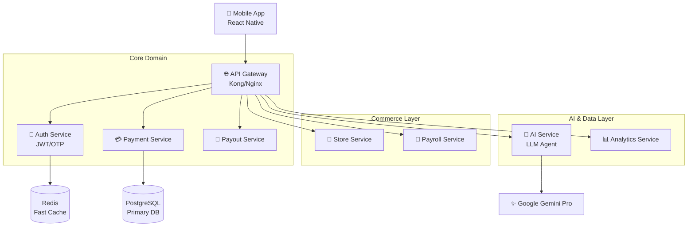

# Nano 🇮🇳✨

[](https://razorpay.com)
[](https://opensource.org/licenses/MIT)
[](https://github.com/Lingikaushikreddy/Nano-Prototype)
[](https://fastapi.tiangolo.com)

**Nano** is a revolutionary mobile-first money management platform designed specifically for India's **63+ million unregistered merchants**.

> *"Making business money management as simple as a WhatsApp text."*

---

## 📱 Product Vision

Kirana store owners, street vendors, and homepreneurs currently juggle personal UPI apps, paper ledgers, and cash. **Nano** unifies these into a single, voice-enabled financial operating system.

### 🌟 Why Nano?
| Feature | Why it matters |
|---------|----------------|
| **🗣️ Vernacular AI** | Speak in 10+ Indian languages (Hindi, Tamil, Telugu...) to manage money. |
| **🎙️ Voice Native** | *"Sharma ji se 500 lo"* - Done. No typing needed. |
| **⚡ 3-Tap Efficiency** | Every core action takes < 3 taps. Optimized for speed. |
| **🤖 Smart Assistant** | AI that predicts cash crunches and suggests actions. |

---

## 🚀 Key Features

### 💰 Money In (Collections)
- **Instant Payment Pages:** professional landing page in <60 seconds.
- **Smart Links:** Auto-reminders via WhatsApp for due payments.
- **Dynamic QR:** One QR for all UPI apps.

### 💸 Money Out (Payouts)
- **Vendor Payouts:** Pay suppliers via IMPS/NEFT/UPI instantly.
- **Payroll:** 1-tap salary disbursement for staff.
- **Bill Pay:** Electricity, Mobile, DTH with auto-fetch.

### 🧠 Intelligence
- **Nano Assistant:** Conversational AI for all financial ops.
- **Cash Flow Forecast:** Know your future balance today.
- **Smart Reports:** Automated daily summaries on WhatsApp.

### No-Code Store Builder

Create and manage your online store without any technical knowledge:

- **Quick Product Listing** - Add products with camera capture, set price and stock
- **Flexible Pricing** - Support for daily-changing prices (vegetables, fruits, market-linked items)
  - Voice-based price updates: *"Tamatar 50 rupay, pyaaz 35 rupay"*
  - Quick bulk price update screen
  - "Market Rate" option for fluctuating prices
- **Daily Rate Board** - Generate and share today's prices on WhatsApp
- **Order Management** - Receive and track customer orders with integrated payments

---

## 🏗️ Architecture Design

Nano is built on an enterprise-grade **Microservices Architecture** for scale.



---

## 🛠️ Tech Stack

### 📱 Frontend (Mobile)
- **Framework:** React Native (0.73+)
- **Language:** TypeScript
- **UI System:** React Native Paper + Vector Icons
- **State:** Redux Toolkit + Persist
- **Modules:** `react-native-voice`, `i18next`, `react-native-qrcode-svg`

### ⚙️ Backend (Microservices)
- **Framework:** FastAPI (Python 3.11+)
- **Database:** PostgreSQL (AsyncPG), Redis
- **ORM:** SQLAlchemy 2.0
- **AI:** Google Gemini Pro API
- **Infrastructure:** Docker Compose

---

## ⚡ Getting Started

### Prerequisites
- Docker & Docker Compose
- Node.js ≥ 18
- Python ≥ 3.11

### 1. Installation
```bash
git clone https://github.com/Lingikaushikreddy/Nano-Prototype.git
cd Nano-Prototype
```

### 2. Run Backend
```bash
cd backend
docker-compose up --build -d
# API Gateway live at http://localhost:8000
```

### 3. Run Mobile App
```bash
cd mobile
npm install
npm run android  # or npm run ios
```

---

## 🗺️ Roadmap

- [x] **Phase 1: Foundation (MVP)**
    - Core Microservices Setup
    - Basic Mobile App Structure
    - Payment & Payout Logic
- [ ] **Phase 2: Beta**
    - Online Store Builder
    - Payroll Management System
    - WhatsApp Integration
- [ ] **Phase 3: Scale**
    - Full Voice AI Integration
    - Advanced Analytics Dashboard
- [ ] **Feature: Rust Core**
    - High-performance **Ledger Service** in Rust (See [Proposal](./docs/RUST_PROPOSAL.md))

---

## 🤝 Contributing & License

We welcome contributions! See [CONTRIBUTING.md](CONTRIBUTING.md) for details.

This project is licensed under the **MIT License**.

---

<p align="center">
  Built with ❤️ for <b>Bharat</b> 🇮🇳
</p>
